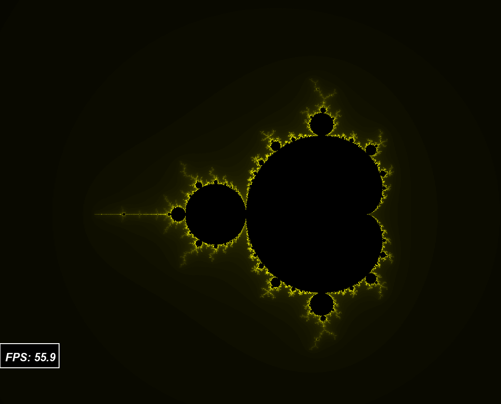

# Mandelbrot

## General information



Lab work on programming from the ded32 course on optimization of calculation. As an algorithm of calculation I use the Mandelbrot set.
I have to measure the time spent on calculation and try to reduce it with my optimizations.

To debug the algorithm I draw the Mandelbrot set with SFML.


## Context

- [Program](#program)
    - [Algorithm](#algorithm)
    - [Modes](#modes)
    - [Graphics](#graphics)
- [Optimization](#optimization)
    - [btop++](#btop)
    - [My hardware](#hardware)
    - [Performance measurement](#productivity)

## Program

### Algorithm

The Mandelbrot set uses x and y axes, where ```c = x + yi```. Start with ```z = 0```. Iterate using ```z = z² + c```. In x-y terms:
```
z_x = z_x² - z_y² + x
z_y = 2 * z_xy + y
```
where:
- ```x``` -----  X coordinate of the calculated pixel
- ```y``` -----  Y coordinate of the calculated pixel
- ```z_x``` ----- real part
- ```z_y``` ----- imaginary part
- ```z_xy``` ----- ```z_x * z_y```

We keep track of the number of steps it takes for the point to go outside the circle. If this does not happen before N iterations, the loop stops.

My const values:
- Size of graphics window = `800*800`
- Radius of circle = `10`
- N = `256`

There are three implementations of this:

**1.** Simple - *pixel-by-pixel calculation*

**2.** Vector - *vectorization*, help compiler to optimize (consider arrays of 8 pixels)

**3.** AVX - *vectorization with `AVX`*, using SIMD intrinsics

### Modes

- **Image output**. Used to verify the algorithm and calculate the FPS
- **Timing**. Used to measure the running time of n iterations of the Mandelbrot algorithm

### Graphics

The color is compiled by this algorithm for each of the rgb colors:

|                color.r                |                color.g               |      color.b      |
|---------------------------------------|--------------------------------------|-------------------|
|     ```r = (255*2.5 * t) + 7;```      |     ```g = (255*2.5 * t) + 7;```     |         0         |
| ```color.r = (r > 255 ? 255 : r);```  | ```color.g = (g > 255 ? 255 : g);``` | ```color.b = b``` |

In this way, the black areas from which the point failed to escape will be visible

## Optimization

### btop++

It is a modern, colorful command-line resource monitor for Linux, macOS, and BSD systems. Written in C++ as an evolution of *bashtop* and *bpytop*, it provides real-time stats on CPU, memory, disks, network, and processes.

I will use btop to track the load on the processor cores and its temperature.

### My hardware

- **Processor:** ```AMD Ryzen 5 4500U 2.3 GHz (4 GHz in Turbo)```
- **OS:** ```Ubuntu 24.04.2 LTS```

Stabilized processor parameters during measurements:
- **Temperature:** ```76°C```
- **Frequency:** ```1.4 ± 0.1 GHz```


### Performance measurement

We will measure 20 times for each version of the algorithm, running the algorithm itself 300 times.

The full table of measurements can be found [here](https://github.com/daniilgriga/Mandelbrot/blob/main/data.md)

Based on these results, I constructed a histogram:


